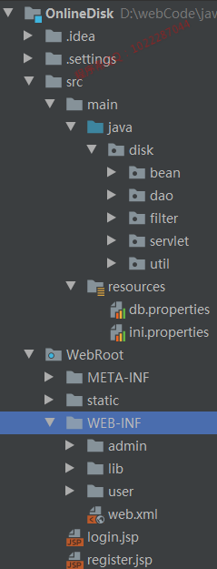
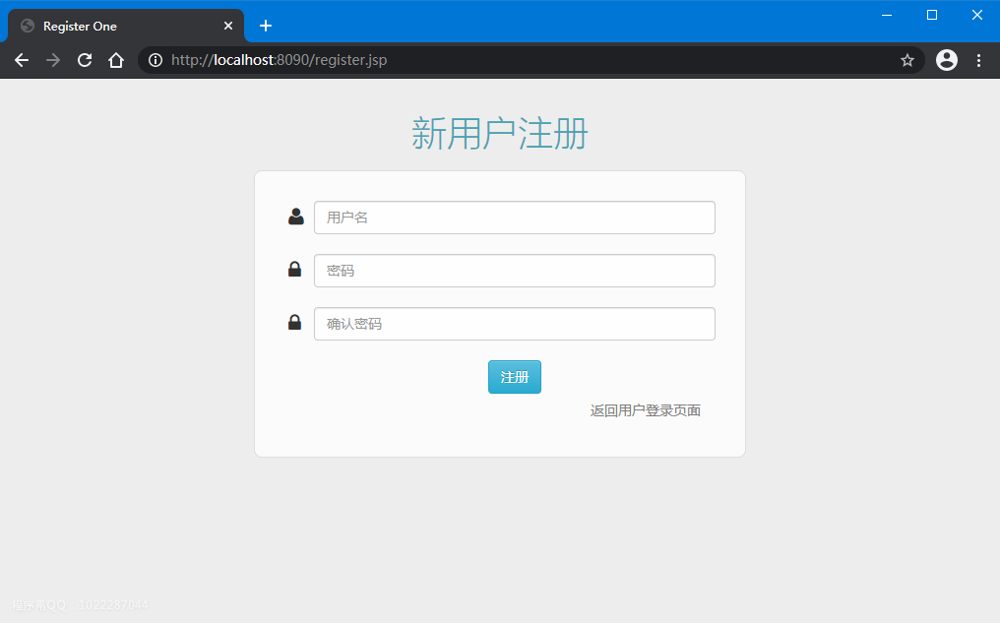

# OnlineDisk
毕设java共享网盘

程序有问题就找[程序帮](http://suo.nz/530ijn)：QQ1022287044

项目介绍
----
> 在线共享网盘采用jsp+servlet搭建项目结构实现共享网盘，项目分为管理员，普通用户和会员三种角色，根据不同角色控制不同权限，实现不同用户对个人文件文件，所有文件，共享文件的增删改查操作。

项目适用人群
----
正在做毕设的学生，或者需要项目实战练习的Java学习者

开发环境：
-----
1. jdk 8
2. intellij idea
3. tomcat 8.5.40
4. mysql 5.7

所用技术：
-----
1. jsp+servlet
2. js+ajax
3. layUi
4. jdbc直连

项目访问地址
---
```
http://localhost:8090
```

项目结构
-----


项目截图
----
- 注册



- 我的网盘


- 我的共享


- 会员充值


- 管理员-所有文件


- 管理员-共享文件


关键代码:
-----
1.初始化工作
```diff
//数据库连接初始化
public class DBInfo {
	String url = null;
	String username = null;
	String password = null;
	String driverClass = null;
	
	private static DBInfo db = new DBInfo();

	public static DBInfo getInstance(){
		return db;
	}
	
	private DBInfo() {
		InputStream in = this.getClass().getClassLoader().getResourceAsStream("db.properties");
		Properties pp = new Properties();
		try {
			pp.load(in);
			url = pp.getProperty("jdbc.url");
			username = pp.getProperty("jdbc.username");
			password = pp.getProperty("jdbc.password");
			driverClass = pp.getProperty("jdbc.driver");
			
			Class.forName(driverClass);
		} catch (Exception e) {
			e.printStackTrace();
		}finally{
			try {
				in.close();
			} catch (IOException e) {
				e.printStackTrace();
			}
		}
	}

	public Connection getConnection(){
		Connection conn = null;
		try {
			conn = DriverManager.getConnection(url, username, password);
		} catch (Exception e) {
			e.printStackTrace();
		}
		return conn;
	}
}
//上传资源初始化
public void init() throws ServletException {
    super.init();
    //servlet启动时  ，读取配置文件中关于上传的信息
    InputStream in = this.getClass().getClassLoader().getResourceAsStream("ini.properties");
    Properties pp = new Properties();
    try {
        pp.load(in);
        UPLOAD_ROOT_PATH = pp.getProperty("upload.path");
        String tmpPath = pp.getProperty("tmp.path");
        //配置上传临时目录
        factory = new DiskFileItemFactory(1024*1024*10,new File(tmpPath));
        stu = new ServletFileUpload(factory);
    } catch (Exception e) {
        e.printStackTrace();
    }finally{
        try {
            in.close();
        } catch (IOException e) {
            e.printStackTrace();
        }
    }
}
```

2.资源上传
```diff
//前端JSP代码
<div class="modal fade" id="uploadModal" tabindex="-1" role="dialog" aria-labelledby="uploadFile" aria-hidden="true">
        <form action="upload" method="post" enctype="multipart/form-data">
            <input type="hidden" name="from" value="user">
            <div class="modal-dialog">
                <div class="modal-content">
                    <div class="modal-header">
                        <button type="button" class="close" data-dismiss="modal" aria-hidden="true">&times;</button>
                        <h4 class="modal-title" id="uploadFile">上传文件</h4>
                    </div>
                    <div class="modal-body">
                        <input type="file" name="file" value="上传文件">
                    </div>
                    <div class="modal-footer">
                        <button type="button" class="btn btn-default" data-dismiss="modal">
                            关闭
                        </button>
                        <input type="submit" class="btn btn-primary" value="确定上传"/>
                    </div>
                </div>
        </form>
    </div>
//后端入库处理
protected void doPost(HttpServletRequest request, HttpServletResponse response) throws   IOException {
    User user = (User) request.getSession().getAttribute(Const.SESSION_USER);
    String from="";
    try {
        List<FileItem> fileItemLists = stu.parseRequest(request);
        for(FileItem fileItem : fileItemLists){
            if(fileItem.isFormField()){
                from = fileItem.getString();
            }else{
                //上传文件名
                String fileName = fileItem.getName();
                String oldfilename = fileItem.getName();
                int index = fileName.lastIndexOf("\\");
                if(index != -1) {
                    fileName = fileName.substring(index+1);
                }
                String root = UPLOAD_ROOT_PATH+user.getUsername();
                //获取文件大小
                long size = fileItem.getSize();
                String sizeString = StringUtil.computeSize(size);
                Timestamp upTime = new Timestamp(new Date().getTime());
                File file = new File(root,fileName);

                //解决文件同名
                int cnt = 1;
                while(file.exists()){
                    StringBuffer sb = new StringBuffer(fileName);
                    sb.insert(sb.lastIndexOf("."), "("+cnt+")");
                    file = new File(root,sb.toString());
                    cnt++;
                }
                //文件路径是否存在
                if(!file.getParentFile().exists()){
                    file.getParentFile().mkdirs();
                }
                try {
                    fileItem.write(file);
                    //上传成功，数据库保存记录
                    UserFile userFile = new UserFile();
                    userFile.setCreateTime(upTime);
                    userFile.setFilename(file.getName());
                    userFile.setFilename(file.getName());
                    userFile.setFileSize(sizeString);
                    userFile.setIsShared(0);
                    userFile.setOwnerId(user.getId());
                    userFile.setPath(file.getAbsolutePath());
                    userFile.setOldfilename(oldfilename);
                    userFileDao.save(userFile);
                    response.sendRedirect(from+"?action=mydisk");
                } catch (Exception e) {
                    e.printStackTrace();
                    response.getWriter().print("上传出错");
                }
            }
        }
    } catch (FileUploadException e) {
        e.printStackTrace();
        response.setContentType("text/html; charset=utf8");
        response.getWriter().print("上传出错!!");
    }
}
```
 
3.检索重复上传的资源
```
//这里上传在上面上传资源时候，将保存原始资源名字
public List<UserFile> findRetrieveListByOwnerId(int ownerId,int isDelete){
    List<UserFile> fileList = new ArrayList<UserFile>();
    Connection conn = db.getConnection();
    PreparedStatement ps = null;
    ResultSet rs = null;
    UserFile userFile = null;
    String sql="select * from file where oldfilename in ( " +
            " select a.oldfilename from (select oldfilename,count(id) counts from file GROUP BY oldfilename  HAVING counts>1) a" +
            " ) and  ownerid=? and isDelete=?";
    ps = conn.prepareStatement(sql);
    ps.setInt(1, ownerId);
    ps.setInt(2, isDelete);
    rs = ps.executeQuery();
    while(rs.next()){
        userFile = new UserFile();
        userFile.setId(rs.getInt(1));
        userFile.setFilename(rs.getString(2));
        userFile.setPath(rs.getString(3));
        userFile.setCreateTime(rs.getTimestamp(4));
        userFile.setIsShared(rs.getInt(5));
        userFile.setOwnerId(rs.getInt(6));
        userFile.setFileSize(rs.getString(7));
        userFile.setCounts(rs.getInt(8));
        userFile.setSharedReason(rs.getString("SharedReason"));
        userFile.setSharedTime(rs.getString("SharedTime"));

        fileList.add(userFile);
    }
    return fileList;
}

```

4.平台会员充值
```diff
//前端jsp代码
<body>
	<div id="wrapper">
		<%@include file="common/nav.jsp" %>
		<div id="page-wrapper">
			<div class="">
		<div class="col-md-12">
			<h1 class="margin-bottom-15">以下是微信付款码，扫码即可支付</h1>
            <div class="form-group">
                <div class="col-md-12">
                    <div class="control-wrapper">
                        <div class="text-center" id="div1">
                            <input type="submit" value="扫码付款"  class="btn btn-success">
                        </div>
                        <div class="text-center" id="div2" style="display: none;">
                            <input type="submit" value="恭喜您，完成扫码支付！"class="btn btn-warning">
                        </div>
                    </div>
                    <div class="text-center">
                        <font color="green">${msgSuccess }</font>
                        <font color="red">${msgFail }</font>
                    </div>
                </div>
            </div>
			<form class="form-horizontal templatemo-container templatemo-login-form-1 margin-bottom-30" role="form" action="user" method="post">
				<input type="hidden" name="action" value="editSubmit">
		        <div class="form-group">
		          
		        </div>
		      </form>
		</div>
	</div>
		</div>
	</div>
</body>
//js实现,采用定时跳转模拟真实用户支付流程，后续进行改动用户会员状态
var test1 = setTimeout(function(){
    $("#div1").css("display","none");
    $("#div2").css("display","block");
    layer.msg('恭喜您，完成扫码支付！', {time: 4000, icon:6},function () {
        window.location.href="user?action=doTopUp";
    });
    clearTimeout(test1);
},5000);
//后端代码
public void doTopUp(User user) {
    Connection conn = db.getConnection();
    PreparedStatement ps = null;
    ResultSet rs = null;
    try {
        //members=1为会员状态
        ps = conn.prepareStatement("update user set members = 1 where id = ?");
        ps.setInt(1, user.getId());
        ps.execute();
    } catch (SQLException e) {
        e.printStackTrace();
    } finally {
        try {
            if (conn != null)
                conn.close();
            if (ps != null)
                ps.close();
            if (rs != null)
                rs.close();
        } catch (SQLException e) {
            e.printStackTrace();
        }
    }
}

``` 

项目后续
----
其他ssh，ssm，springboot版本后续迭代更新，持续关注
